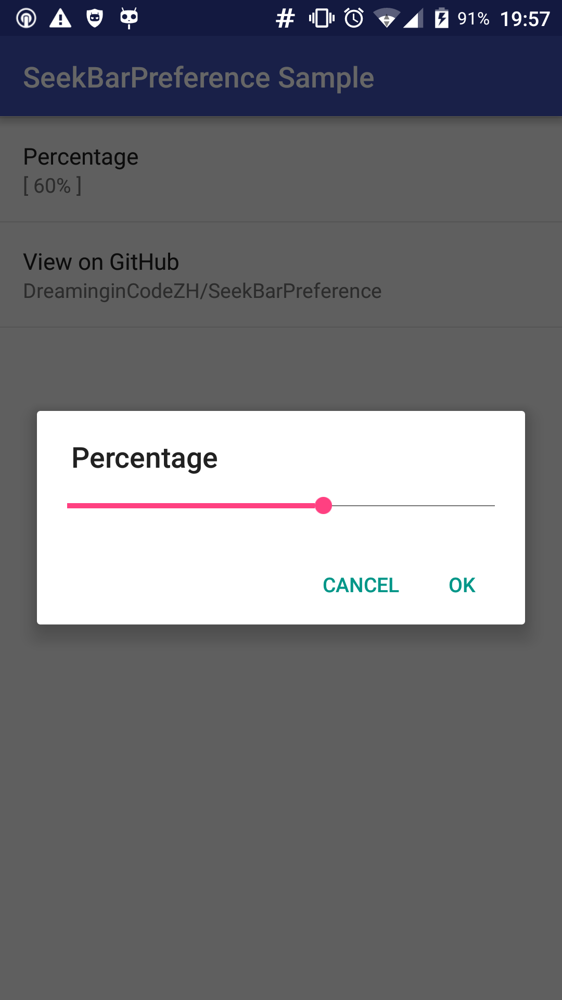

# SeekBarPreference

A `Preference` that shows a `Dialog` with a `SeekBar` widget.

This `Preference` is based on support library `preference-v7`.



## Integration

In your `PreferenceFragmentCompat`, override `onDisplayPreferenceDialog(Preference)` as follows:

```java
@Override
public void onDisplayPreferenceDialog(Preference preference) {
    if (!SeekBarPreference.onDisplayPreferenceDialog(this, preference)) {
        super.onDisplayPreferenceDialog(preference);
    }
}
```

## Usage

This `SeekBarPreference` is written according to `EditTextPreference` implementation, and can be used in a similar way.

Attributes set in XML can also apply to the `SeekBar` in the dialog.

For instance, you can specify `android:max` in XML to set the maximum value for the `SeekBar`.

You can also get and customize the `SeekBar` that will appear in the `Dialog` by calling `SeekBarPreference.getSeekBar()`.

The summary of `SeekBarPreference` is optionally formatted with its progress and max. You can also subclass it and use `SeekBarPreference.getRawSummary()` to format with your custom information.

## License

    Copyright 2015 Zhang Hai

    Licensed under the Apache License, Version 2.0 (the "License");
    you may not use this file except in compliance with the License.
    You may obtain a copy of the License at

       http://www.apache.org/licenses/LICENSE-2.0

    Unless required by applicable law or agreed to in writing, software
    distributed under the License is distributed on an "AS IS" BASIS,
    WITHOUT WARRANTIES OR CONDITIONS OF ANY KIND, either express or implied.
    See the License for the specific language governing permissions and
    limitations under the License.
